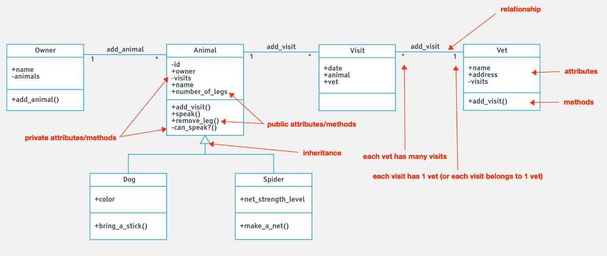

# Guidelines_Ruby

> This is a self paced Ruby Practice. The classes and relationships were created based on the UML class diagram attached below.

## Topics covered
- Association, aggregation, and composition
- OOP Relationships
- OOP Four Principles
- Design patterns


## Run project

```command prompt - irb
$ irb
```

## UML Class Diagram
